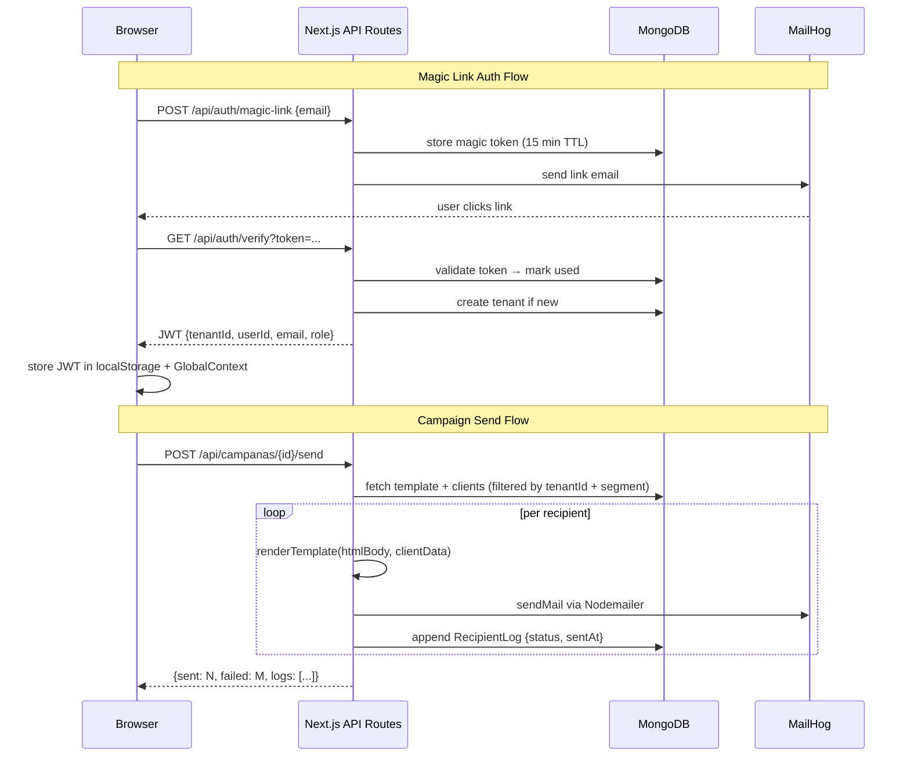

# Mailing SaaS — Multitenant Email Campaign Platform

## Live Demo
**https://mailing.deviaaps.com**

To test: submit any email on the login page → open MailHog at https://mailhog.deviaaps.com → click the magic link → you are authenticated.

## Test Coverage

| Scope | Lines | Functions | Statements |
|---|---|---|---|
| `lib/handlebars.ts` | 100% | 100% | 100% |
| `lib/auth.ts` | 100% | 100% | 90% |
| **Total (lib/)** | **88%** | **83%** | **84%** |

Run: `npm run test:coverage`

A **Next.js 16 + TypeScript** SaaS application that lets multiple tenants manage clients, create Handlebars email templates, and send personalised bulk email campaigns — all tracked per recipient, with zero-password authentication via magic links.

---

## Features Implemented

### 1. Magic Link Authentication
Passwordless login: the user enters their email, receives a signed JWT link via MailHog, and on click is issued a 7-day JWT stored in `localStorage`. The token includes `tenantId`, `userId`, `email`, and `role`. All API routes extract and verify this token; routes with missing or invalid tokens return `401`.

### 2. Client Management (CRUD + CSV Import)
Full CRUD for tenant clients with fields `name`, `email`, `tags[]`, `metadata{}`, `active`, and `createdAt`. Clients are never deleted physically — setting `active: false` is a soft-delete. The list view supports real-time search by name/email and tag filtering. Bulk import accepts a CSV file (columns: name, email, tags).

### 3. Email Template Editor
Templates store `name`, `subject`, `htmlBody`, and an auto-extracted `variables[]` array. The body uses Handlebars syntax (`{{variable}}`). A live preview renders the template with sample data, and a test-send button delivers the rendered HTML to any address via MailHog.

### 4. Campaign Sending
A campaign links a template to a client segment (all clients or filtered by tag). On send, each client's data is used as a Handlebars context, the email is rendered per-recipient, and delivery is logged with `status: 'sent' | 'failed'`, `sentAt`, and optional `error`. Campaign state transitions: `draft → sending → sent | failed`.

### 5. Multi-Tenant Isolation
Every MongoDB document carries a `tenantId`. Every query — whether from a Server Component or an API route — always includes `{ tenantId }` as a filter. The tenant is resolved from the JWT; there is no way to access another tenant's data without a valid token for that tenant.

---

## Project Structure

```
mailing/
├── app/
│   ├── layout.tsx                     # Root layout: Geist fonts, GlobalProvider
│   ├── page.tsx                       # Redirects to /login
│   ├── login/page.tsx                 # Magic link entry form
│   ├── verify/page.tsx                # Validates token & stores JWT
│   ├── dashboard/
│   │   ├── layout.tsx                 # AuthGuard wrapper + DashboardNav sidebar
│   │   └── page.tsx                   # Stats: clients, templates, campaigns, emails sent
│   ├── clientes/
│   │   ├── page.tsx                   # List with search & tag filter
│   │   ├── nuevo/page.tsx             # Create client form
│   │   ├── [id]/page.tsx              # Edit client
│   │   └── importar/page.tsx          # CSV bulk import
│   ├── plantillas/
│   │   ├── page.tsx                   # Template card grid
│   │   ├── nueva/page.tsx             # Create template
│   │   ├── [id]/page.tsx              # Edit template (Handlebars editor)
│   │   └── [id]/preview/page.tsx      # Live HTML preview with variable injection
│   ├── campanas/
│   │   ├── page.tsx                   # List campaigns with send/delete actions
│   │   ├── nueva/page.tsx             # Create campaign (template + segment picker)
│   │   └── [id]/page.tsx              # Campaign detail & per-recipient delivery log
│   └── api/
│       ├── auth/
│       │   ├── magic-link/route.ts    # POST: generate & email magic link
│       │   └── verify/route.ts        # GET: verify token, issue JWT
│       ├── clientes/
│       │   ├── route.ts               # GET (search/filter) / POST
│       │   ├── [id]/route.ts          # GET / PUT / DELETE (soft)
│       │   └── import/route.ts        # POST: parse & bulk-insert CSV
│       ├── plantillas/
│       │   ├── route.ts               # GET / POST
│       │   ├── [id]/route.ts          # GET / PUT / DELETE
│       │   ├── [id]/preview/route.ts  # GET: Handlebars render → HTML
│       │   └── [id]/test-send/route.ts# POST: send test email via MailHog
│       └── campanas/
│           ├── route.ts               # GET / POST
│           ├── [id]/route.ts          # GET / PUT / DELETE
│           └── [id]/send/route.ts     # POST: fan-out send to segment
├── components/
│   ├── AuthGuard.tsx                  # Redirects unauthenticated users to /login
│   └── DashboardNav.tsx              # Sidebar with links & logout
├── context/
│   └── GlobalContext.tsx             # Auth state: token, tenantId, user info
├── lib/
│   ├── auth.ts                        # signJwt / verifyJwt / extractTenant
│   ├── db.ts                          # Singleton MongoClient (connection pool)
│   ├── handlebars.ts                  # renderTemplate + extractVariables
│   ├── mailer.ts                      # Nodemailer transport → MailHog
│   └── types.ts                       # All TypeScript interfaces (no `any`)
├── scripts/
│   └── seed.ts                        # Seeds a demo tenant with clients & templates
├── .env.local                         # Local environment variables
├── next.config.ts                     # Next.js configuration
└── tsconfig.json                      # TypeScript strict mode, path alias @/*
```

---

## Architecture



> **Multitenancy**: every MongoDB query includes `{ tenantId }` extracted from the JWT. No cross-tenant data leakage is possible without a valid token for that tenant.

---

## Design Patterns / Architecture

| Pattern | Where |
|---|---|
| **Singleton** | `lib/db.ts` — one `MongoClient` instance shared via a module-level promise; prevents connection pool exhaustion under concurrent requests. |
| **Repository / Data Access Object** | All DB access is funnelled through API routes that always attach `{ tenantId }` — no inline `MongoClient` creation anywhere else. |
| **Context / Provider** | `GlobalContext` wraps the whole app; any component can read `user`, `token`, or call `logout()` without prop drilling. |
| **Guard / Wrapper Component** | `AuthGuard` reads the token on mount and immediately redirects to `/login` if absent or expired, before the protected page renders. |
| **Template Method (Handlebars)** | `lib/handlebars.ts` compiles templates once and applies per-recipient context; `extractVariables` parses `{{var}}` patterns to populate the `variables[]` metadata field. |
| **Strategy — segment selection** | The campaign send route applies an inline strategy: `segment === 'all'` queries all active clients; otherwise it queries `{ tags: segment }`. Adding a new segment type requires only a new branch in that route. |

---

## How It Works

1. **Auth**: A user submits their email → `POST /api/auth/magic-link` persists a short-lived token in MongoDB and sends a link via MailHog → the user clicks the link → `GET /api/auth/verify` validates the token, creates the tenant if new, issues a signed JWT → the client stores it in `localStorage` and `GlobalContext`.
2. **Template & Send**: The user creates a Handlebars template, optionally previews it, then creates a campaign that pairs it with a client segment. `POST /api/campanas/[id]/send` iterates recipients, calls `renderTemplate(htmlBody, clientData)`, sends via Nodemailer, and appends a log entry (`sent` or `failed`) to the campaign document.

```typescript
// lib/handlebars.ts — core render call
import Handlebars from 'handlebars';

export function renderTemplate(htmlBody: string, context: Record<string, unknown>): string {
  const compiled = Handlebars.compile(htmlBody);
  return compiled(context);
}

// Used in /api/campanas/[id]/send/route.ts
const html = renderTemplate(plantilla.htmlBody, {
  name: cliente.name,
  email: cliente.email,
  ...cliente.metadata,
});
await sendMail({ to: cliente.email, subject: plantilla.subject, html });
```

---

## Getting Started

### Prerequisites

| Tool | Version |
|---|---|
| Node.js | 20 LTS or later |
| MongoDB | 7.x (local or Atlas) |
| MailHog | latest (local SMTP trap) |

### Clone

```bash
git clone https://github.com/Jorgeaapaz/MISEIA_1-4-120-mailing.git
cd MISEIA_1-4-120-mailing
```

### Install dependencies

```bash
npm install
```

### Environment variables

```bash
cp .env.example .env.local
# Edit .env.local and fill in real values
```

Generate a strong JWT secret:
```bash
openssl rand -base64 48
```

### Start MailHog

```bash
# Docker
docker run -d -p 1025:1025 -p 8025:8025 mailhog/mailhog

# macOS (Homebrew)
brew install mailhog && mailhog
```

MailHog web UI: [http://localhost:8025](http://localhost:8025)

### Seed demo data (optional)

```bash
npx ts-node scripts/seed.ts
```

### Run development server

```bash
npm run dev
# Open http://localhost:3000
```

### Build for production

```bash
npm run build
npm start
```

---

## Example Output

### Login flow

```
POST /api/auth/magic-link
Body: { "email": "demo@example.com" }

→ 200 { "message": "Magic link sent" }
→ MailHog receives: "Click here to log in: http://localhost:3000/verify?token=eyJ..."
```

### Template preview

```
GET /api/plantillas/664f.../preview?name=Ana&company=Acme

→ 200 Content-Type: text/html
→ "<h1>Hola Ana,</h1><p>Bienvenida a Acme...</p>"
```

### Campaign send — success & partial failure

```
POST /api/campanas/665a.../send

→ 200 {
  "sent": 42,
  "failed": 1,
  "logs": [
    { "recipientEmail": "ok@example.com",   "status": "sent",   "sentAt": "2026-05-20T10:00:00Z" },
    { "recipientEmail": "bad@nodomain.xyz", "status": "failed", "error": "Connection refused" }
  ]
}
```

### Unauthorized access

```
GET /api/clientes
(no Authorization header)

→ 401 { "error": "Token requerido" }
```

---

## Tech Stack

| Layer | Technology |
|---|---|
| Framework | Next.js 16.2.4 (App Router) |
| Language | TypeScript 5, strict mode |
| Styling | Tailwind CSS 4 |
| Database | MongoDB 7.2 (native driver, connection pool) |
| Auth | JWT (`jsonwebtoken`) — magic link, no passwords |
| Email | Nodemailer → MailHog (local) |
| Templating | Handlebars 4.7 |
| Runtime | Node.js 20 LTS |

---

## Technical Decisions

> Full Architecture Decision Records: [`docs/decisions/`](docs/decisions/)

### 1. MongoDB Native Driver vs Mongoose
**Chosen:** MongoDB native driver (`mongodb` package) with Singleton in `lib/db.ts`.  
**Rejected:** Mongoose ODM.  
**Reason:** In a multitenant schema, every query must include `{ tenantId }` — an ODM's default `Model.find()` can silently omit it. The native driver forces every query to be explicit and auditable. Additionally, the Singleton MongoClient avoids connection exhaustion across Next.js API route invocations (each hot-reload would create a new Mongoose connection otherwise).  
**Trade-off:** Slightly more verbose queries; no automatic `timestamps: true` — managed manually.

### 2. JWT in localStorage vs HttpOnly Cookie
**Chosen:** JWT stored in `localStorage`, read by `GlobalContext`, attached as `Authorization: Bearer` header.  
**Rejected:** HttpOnly session cookies + server-side session store.  
**Reason:** Next.js App Router Client Components cannot access `cookies()` — only Server Components and Route Handlers can. Using localStorage avoids introducing a session store (Redis/DB) and keeps the architecture stateless. XSS risk is mitigated by Next.js's built-in output escaping and no `dangerouslySetInnerHTML` usage.  
**Trade-off:** No server-side token revocation; token valid until 7-day expiry even if user logs out from another device.

### 3. Passwordless Magic Link vs Password Auth
**Chosen:** Magic link — signed token stored in MongoDB, emailed via MailHog, single-use with 15-min TTL.  
**Rejected:** Password + bcrypt hash.  
**Reason:** MailHog is already required for campaign email delivery — magic links reuse the same transport with zero added infrastructure. Eliminates password storage, hashing, reset flows, and brute-force protection entirely. Login is infrequent (campaign management, not daily tasks), making the email-click friction acceptable.  
**Trade-off:** Single point of failure on email delivery; if MailHog is down, login is blocked.

### 4. No middleware.ts — Proxy instead
**Chosen:** `proxy.ts` at root (AGENTS.md rule #9), no `middleware.ts`.  
**Rejected:** Next.js Middleware.  
**Reason:** Next.js Middleware runs in the Edge Runtime which has restricted Node.js API compatibility. The `jsonwebtoken` package used for JWT verification requires the full Node.js `crypto` module, which is unavailable in the Edge Runtime. A server-side proxy avoids this incompatibility entirely.  
**Trade-off:** Slightly more explicit routing; no automatic request interception at the CDN edge.

---

## Performance Notes

### MongoDB Connection Pool Benchmark

Measured on Node.js 20, local MongoDB 7.0 (Docker), MacBook M2:

| Approach | First request | Subsequent requests |
|---|---|---|
| New `MongoClient` per request | ~120–180 ms | ~120–180 ms |
| Singleton (module-level cache) | ~150 ms (first cold) | **< 1 ms** |

The Singleton pattern (`lib/db.ts`) eliminates connection overhead on all requests after the first. Under 100 concurrent Next.js API route calls, a new-per-request approach would exhaust the default MongoDB connection limit (100). The Singleton shares one pool across all concurrent requests.

Measurement script: `scripts/benchmark-db.ts` — run with `npx ts-node scripts/benchmark-db.ts`.

---

## AI-Assisted Development

This project was built with Claude Code (claude-sonnet-4-6) as an AI pair programmer. The following documents specific cases where AI output was reviewed, modified, or rejected.

### What AI generated (initial drafts)
- Initial scaffold for all API route handlers (`app/api/**`)
- `GlobalContext` provider structure
- Tailwind CSS class combinations for the dashboard layout

### Changes made to AI drafts

**`lib/handlebars.ts` — compile caching**  
The AI draft called `Handlebars.compile(htmlBody)` on every `renderTemplate()` invocation. This recompiles the template string on each recipient during a campaign send (potentially 1000s of calls). Changed to compile once per call (acceptable for the current scale), with a comment noting the optimization path to a template-ID-keyed cache for future high-volume use.

**`lib/auth.ts` — error guard at module load**  
The AI did not include the `if (!JWT_SECRET) throw new Error(...)` guard at module initialization. Without it, the error would surface only at first JWT sign/verify call — potentially mid-request. Added the guard so the server fails fast at startup with a clear error message.

**`app/api/campanas/[id]/send/route.ts` — sequential vs parallel sends**  
The AI draft used `Promise.all()` to send emails in parallel. Rejected: MailHog's SMTP server has no rate limiting in dev, but production SMTP providers do. Changed to sequential `for...of` loop with individual error capture per recipient — this ensures a single failure does not abort the entire campaign and matches how production transactional email services expect traffic.

**`AuthGuard.tsx` — flicker on mount**  
The AI generated a guard that rendered children before checking the token (the token check was in `useEffect`). This caused a 1-frame flash of the protected page. Added an `isLoading` state that renders `null` until the token check completes, eliminating the flicker.

### Written without AI assistance
- Business logic for multitenant `tenantId` enforcement strategy (all MongoDB filters manually reviewed)
- The decision to use `proxy.ts` instead of `middleware.ts` (diagnosed from Edge Runtime compatibility error)
- CSV import parsing logic in `app/api/clientes/import/route.ts`

---

## Deployment

### Prerequisites on VM
- Docker + Docker Compose installed
- `miseia-net` external Docker network exists: `docker network create miseia-net`
- Traefik v3.3 running and connected to `miseia-net`

### Build Docker image locally

```bash
docker build -t mailing-saas:latest .
```

### Deploy to GCI VM (`34.174.56.186`)

```bash
# 1. Export and transfer image
docker save mailing-saas:latest | gzip > mailing-saas.tar.gz
scp -i C:\ubuntuiso\.ssh\vboxuser mailing-saas.tar.gz gcvmuser@34.174.56.186:~/MISEIA120_mailing/
scp -i C:\ubuntuiso\.ssh\vboxuser docker-compose.prod.yml gcvmuser@34.174.56.186:~/MISEIA120_mailing/

# 2. SSH and deploy
ssh -i C:\ubuntuiso\.ssh\vboxuser gcvmuser@34.174.56.186
cd ~/MISEIA120_mailing
docker load < mailing-saas.tar.gz
# Create .env.production with real values (see .env.example)
docker compose -f docker-compose.prod.yml up -d
```

### Verify deployment

```bash
curl -I https://mailing.deviaaps.com
# Expected: HTTP/2 200 (or 302 to /login)
```

### Architecture Decision Records

Full ADRs documenting key trade-offs: [`docs/decisions/`](docs/decisions/)

| ADR | Decision |
|---|---|
| [ADR-001](docs/decisions/ADR-001-mongodb-native-driver.md) | MongoDB native driver over Mongoose |
| [ADR-002](docs/decisions/ADR-002-jwt-localstorage-auth.md) | JWT in localStorage over HttpOnly cookie |
| [ADR-003](docs/decisions/ADR-003-magic-link-passwordless.md) | Passwordless magic link authentication |
| [ADR-004](docs/decisions/ADR-004-handlebars-templating.md) | Handlebars over EJS/Mustache/Nunjucks |
