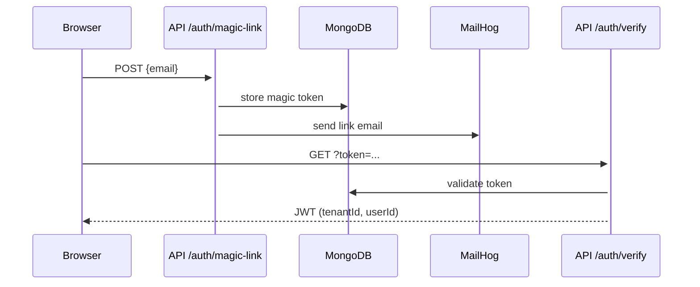

@~/.claude/prompts/new_functionality_prompt_spec.md

# Add Architecture Diagram to README

## Role
Act as a Software Architect with expertise in documentation and system design.

## Context
Project: `D:\Master-IA-Dev\04-Bloque4\1-4-120-mailing\mailing`  
Issue: `dc_diagrama_arquitectura`  
The README has a "Design Patterns / Architecture" table listing patterns but no visual diagram showing components and flows. The evaluator requires a diagram (ASCII, mermaid, or draw.io) showing components and main flows.

## Task
Add a **Mermaid diagram** to `README.md` that shows:
1. The main architectural layers (Browser, Next.js App Router, API Routes, lib/, MongoDB, MailHog).
2. The auth flow (magic link: Browser → API → MailHog → MongoDB → JWT).
3. The campaign send flow (Browser → API → Handlebars → Nodemailer → MailHog).
4. Multitenancy: `tenantId` isolation at the DB layer.

### Diagram Guidelines
- Use `mermaid` code block so GitHub renders it natively.
- Show at minimum: Auth flow + Campaign send flow as sequence or component diagram.
- Keep the diagram readable — maximum ~20 nodes.
- Place the diagram in a new `## Architecture` section before `## Design Patterns`.

## Output format
Updated `README.md` with a `## Architecture` section containing a valid mermaid diagram.

## Examples and Steps to follow

Extend the above to also show the campaign flow.

## Output checklist and Guardrails
- [ ] Mermaid diagram renders correctly on GitHub (test with mermaid.live)
- [ ] Shows auth flow and campaign send flow
- [ ] `## Architecture` section added to README above `## Design Patterns`
- [ ] Diagram has no more than 25 nodes for readability
- [ ] Commit: `git commit -m "docs: add mermaid architecture diagram to README"`
